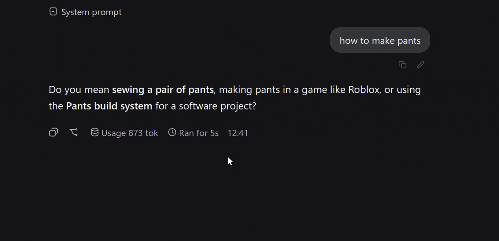

# dsh-prompt-edit

adds in-place prompt editing to DeepSeek Harness

click the pencil on any user message, edit your text, enjoy



## features

* **in-place edit:** tweak any past prompt directly in chat
* **clean branch:** forks history at the target turn // no ghost turns, no corrupted logs
* **keeps attachments:** images and files survive the edit intact
* **auto-archive:** superseded sessions are tucked away into archive so your sidebar stays clean
* **dsh-native:** blends with your active dark/light theme tokens
* **ime-safe:** won't submit while picking pinyin / kanji characters
* **multilingual:** en // zh // ru auto-detected

## shortcuts

* `Enter` // submit (or close if unchanged)
* `Shift + Enter` // new line
* `Ctrl + Enter` // quick submit
* `Escape` // cancel

## install

```bash
dsh plugin --profile web add github:perdakovich/dsh-prompt-edit
```

restart `dsh web` and refresh the page.

## how it works

1. cuts the session history right before the edited turn
2. spawns a clean child session with your updated prompt and attachments
3. archives the old session branch

## license

MIT © PERDUN PERDAKOVICH
